# Why give a talk about tools?

## Motivation

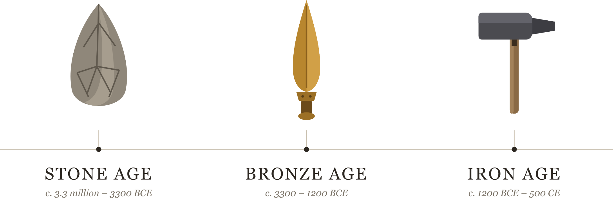{fig-align="center" width=94%}

::: {.notes}
We name an age for the material its tools were made from. Stone, bronze, iron.
The instrument is what the era is remembered by.
:::

## Motivation

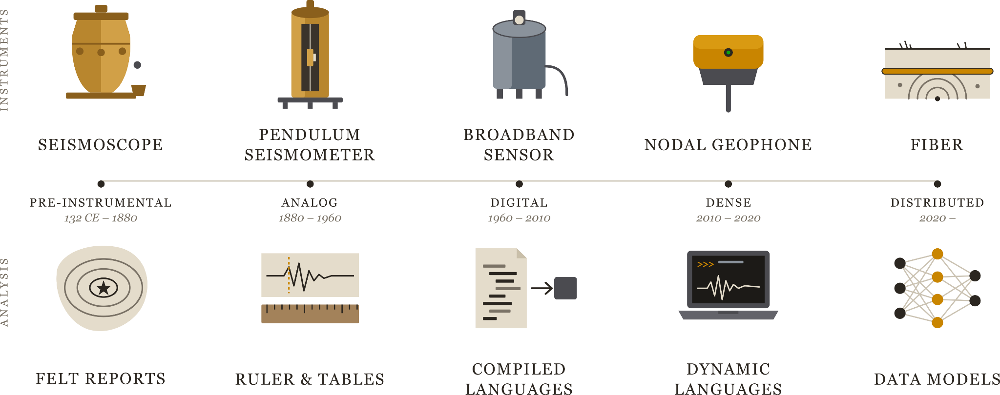{fig-align="center" width=94%}

[&nbsp;]{.cover .fragment .fade-out data-fragment-index="1" style="top:57%; left:0%; width:98%; height:36%;"}

## Motivation

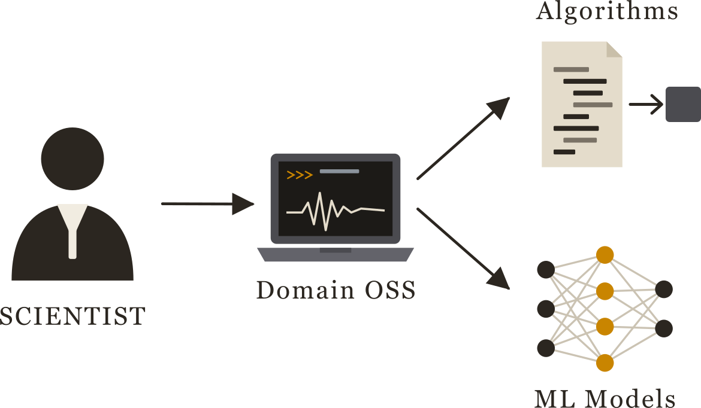{fig-align="center" width=75%}

::: {.notes}
Every one of us writes the same readers, the same filters, the same plots.
:::

# What open DAS tools exist?

## The Tools: Methodology

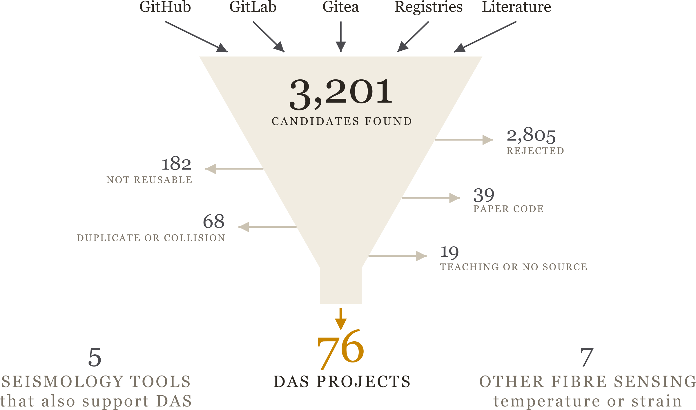{fig-align="center" width=75%}

::: {.notes}
 candidates from forge search, registries and the
literature. Every one leaves by exactly one route. What survives is
 DAS projects, plus
 seismology tools that also support DAS and
 for temperature or strain.
:::

## The Tools: The Results


:::: {.mask-wrap style="width:94%"}
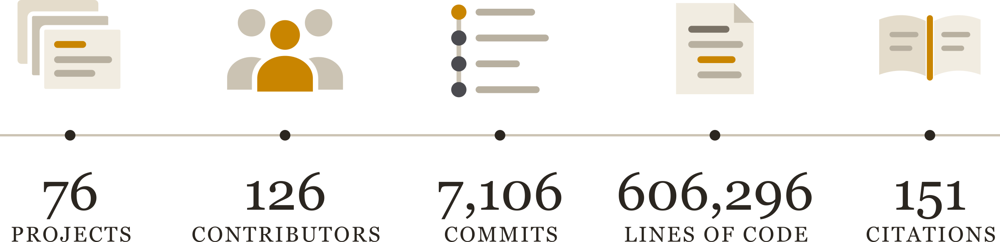{fig-align="center"}

```{=html}
<div class="gate-mask fragment fade-out" data-fragment-index="1" style="left:20.0%"></div>
<div class="gate-mask fragment fade-out" data-fragment-index="2" style="left:40.0%"></div>
<div class="gate-mask fragment fade-out" data-fragment-index="3" style="left:60.0%"></div>
<div class="gate-mask fragment fade-out" data-fragment-index="4" style="left:80.0%"></div>
```
::::


::: {.notes}
 projects,
 contributors,
 commits,
 lines,
 citations.

Citations cover only  of the
projects, so that one is a floor. Lines of code is the softest number — a few
repositories carry vendored content — so lead with projects and commits if
pushed.
:::

## The Tools: Growth Over Time

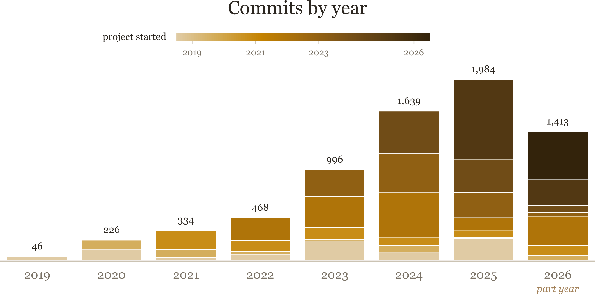{fig-align="center" width=98%}

::: {.notes}
Each year's growth comes mostly from projects that did not exist the year
before. This is a field still arriving, not one consolidating.
:::

## The Tools: Growth Over Time

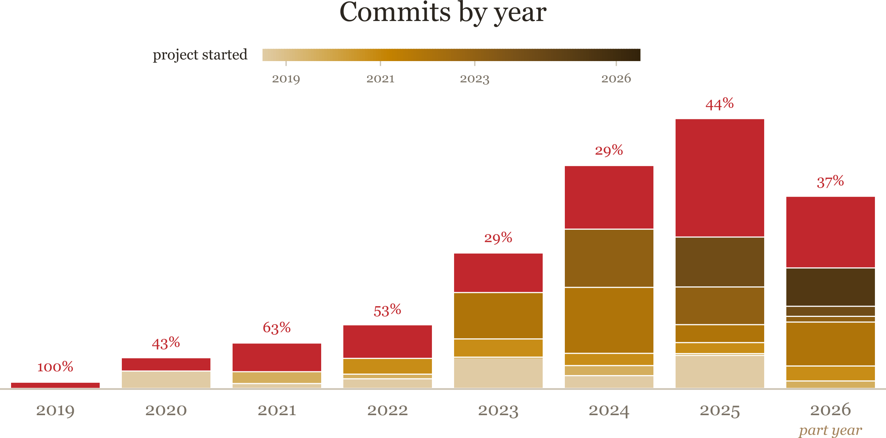{fig-align="center" width=98%}

::: {.notes}
The same chart, with the arrivals in red: every band above the rest is a set
of projects committing in its first year. The figure over each bar is their
share of that year -- 44% of 2025, and 63% of 2021, where nearly two thirds of
the work came from projects that did not exist a year earlier. Growth here is
arrival, not deepening.
:::

## The Tools: Language and Forge

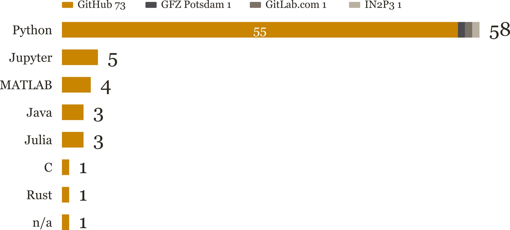{fig-align="center" width=98%}

::: {.notes}
Python and GitHub, overwhelmingly. That is a strength: one ecosystem to
interoperate within.
:::

## The Tools: Egineering Practice

::: {.content-visible when-format="revealjs"}

:::: {.mask-wrap style="width:94%"}
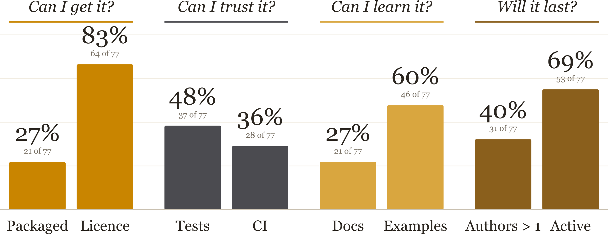{width="100%"}

```{=html}
<div class="gate-mask fragment fade-out" data-fragment-index="1" style="left:24.5%"></div>
<div class="gate-mask fragment fade-out" data-fragment-index="2" style="left:50.0%"></div>
<div class="gate-mask fragment fade-out" data-fragment-index="3" style="left:75.5%"></div>
```
::::

:::

::: {.content-visible when-format="beamer"}
{fig-align="center" width=94%}
:::

::: {.notes}
Four questions a stranger asks before depending on your code. Most answer the
licence one. Two-thirds carry a packaging manifest —
 of
 — but only
 ever published one. That is the mechanical
reason for the next slide.
:::

## The Tools: Dependencies


:::: {.mask-wrap style="width:94%"}
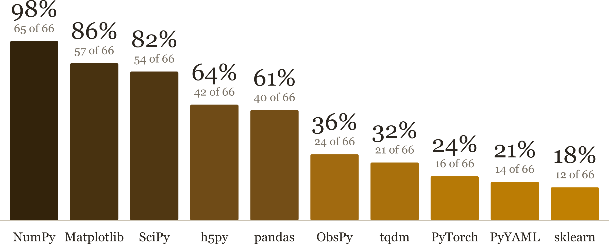{fig-align="center" width=98%}

```{=html}
<div class="gate-mask fragment fade-out" data-fragment-index="1" style="left:31%"></div>
<div class="gate-mask fragment fade-out" data-fragment-index="2" style="left:60.0%"></div>
```
::::


::: {.notes}
And here is what we do build on. Every one of them on NumPy, then Matplotlib,
SciPy, h5py. ObsPy at 37 per cent — from a different field. We share a
foundation, it just is not ours.

If asked why the denominator is 65 and not the 58 on the language chart: 65
ship Python, 58 have Python as their *primary* language. The difference is five
Jupyter repositories plus a Java and a Rust project that also ship Python. The
11 left out have no Python at all — MATLAB, Julia, Java, C.
:::

## The Tools: Dependencies

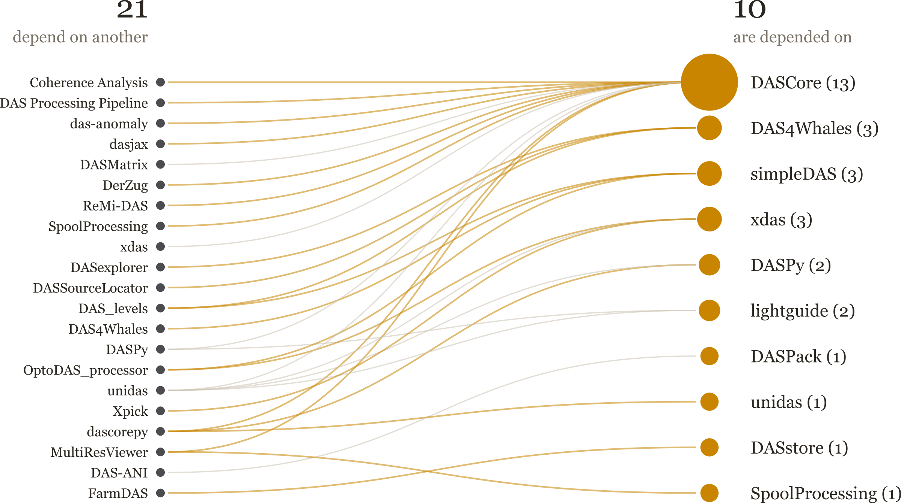{fig-align="center" width=72%}

::: {.notes}
This is the finding.  of the
 projects that declare their dependencies build
on nothing in this census and have nothing built on them. DASCore with
 dependents, six others with one or two
each, everything else standing alone.

The figure shows 12 depending on another and 7 depended on; unidas is in both
columns, so those do not sum to the 18 connected. Same  projects as the next slide, and DASCore is
 on both — the census reads a project's
manifest here, because the seismology set beside it offers nothing else.
:::

## The Tools: Dependency

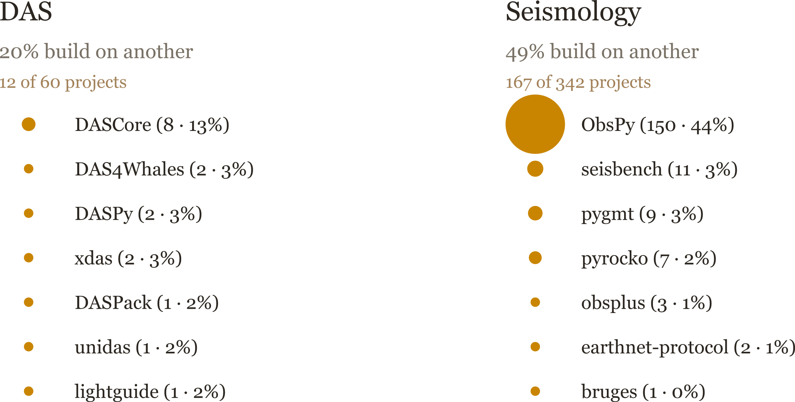{fig-align="center" width=98%}

::: {.notes}
Same measurement, both fields, manifests only so the two are comparable.
Seismology has ObsPy, depended on by
 of its
 projects. We have no equivalent.

Say "roughly half as connected", not the precise percentages — our set is
hand-curated and theirs is scraped.
:::


# Which projects to build on?


## Infrastructure: Requirements

:::{.incremental}
- I/O for DAS files
- Internal data structures
- Processing
- Visualisations
- More than 1 contributor
- at least 1 year old and active
- In code registry
:::


## Infrastructure: The Five

:::: {.content-visible when-format="revealjs"}
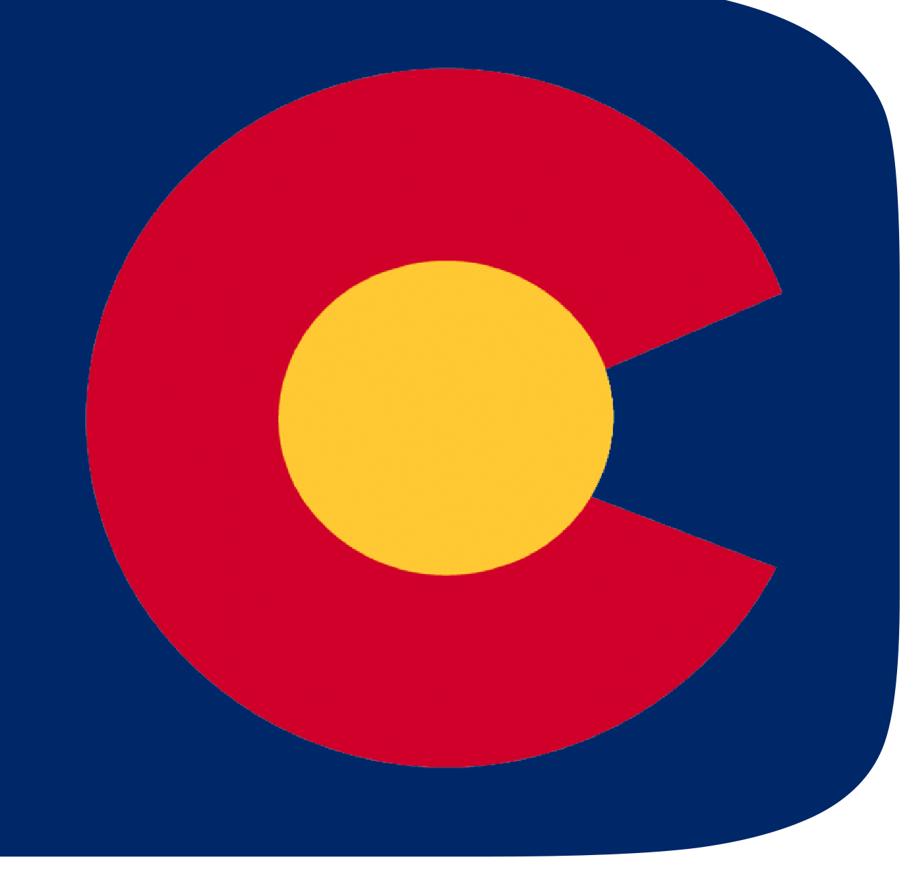{.absolute .fragment top="16.8%" left="2.2%" width="26.1%"}
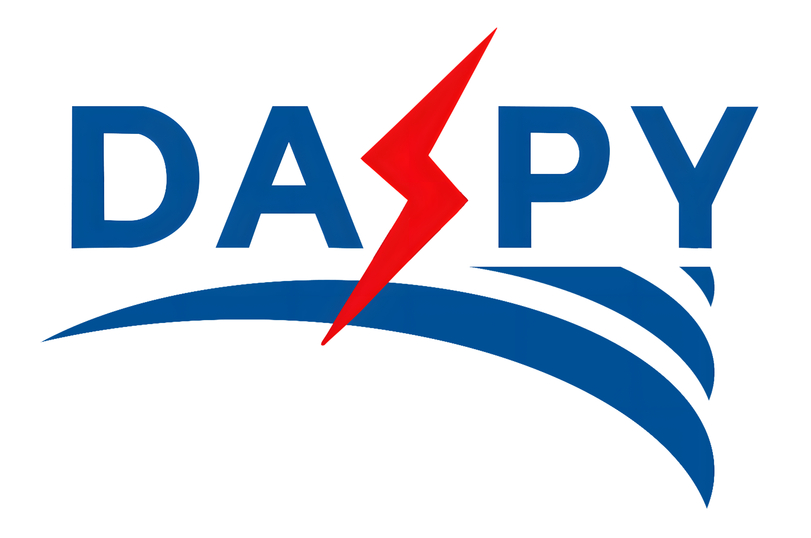{.absolute .fragment top="16.8%" left="32.9%" width="34.3%"}
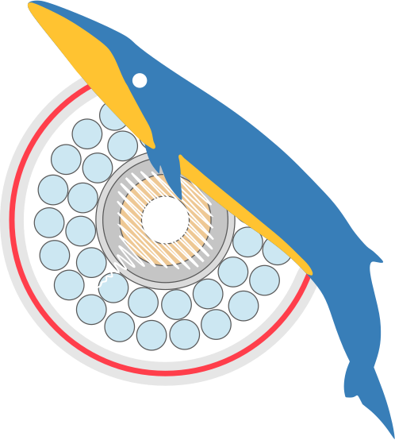{.absolute .fragment top="16.5%" left="67.7%" width="32.3%"}
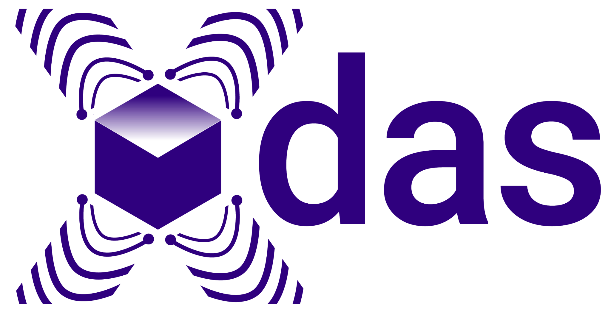{.absolute .fragment top="53.3%" left="29.7%" width="40.6%"}
{.absolute .fragment top="69.7%" left="5.6%" width="14.8%"}
::::

:::: {.content-visible when-format="beamer"}
DASCore · DASPy · DAS4Whales · xdas · Lightguide
::::

::: {.notes}
Name each as it lands. No text on the slide; the logos are the list.
:::

## Infrastructure: Licences

:::: {.content-visible when-format="revealjs"}
{.absolute top="32.5%" left="6.4%" width="22.7%"}
{.absolute top="46.8%" left="30.7%" width="22.8%"}
{.absolute top="12.4%" left="35.8%" width="12.7%"}
{.absolute top="44.4%" left="55.0%" width="19.1%"}
{.absolute top="26.7%" left="71.5%" width="34.3%"}
[&nbsp;]{.axis-arrow style="top:80%; left:4%; width:90%;"}
[Non-Commercial]{.axis-label .absolute top="83.5%" left="1.0%" width="20%"}
[GPL]{.axis-label .absolute top="83.5%" left="27.4%" width="20%"}
[LGPL]{.axis-label .absolute top="83.5%" left="50.7%" width="20%"}
[MIT]{.axis-label .absolute top="83.5%" left="74.0%" width="20%"}
[Licence permissivity]{.axis-caption .absolute top="88.0%" left="30%" width="40%"}
::::

:::: {.content-visible when-format="beamer"}
- **DAS4Whales** — CC BY-NC-SA, non-commercial
- **xdas**, **Lightguide** — GPL-3.0
- **DASCore** — LGPL-3.0
- **DASPy** — MIT
::::

::: {.notes}
Left to right, least permissive to most. DAS4Whales carries a content licence
rather than a software one, which matters before you depend on it downstream.
:::

## Infrastructure: DAS4Whales

:::: {.columns}

::: {.column width="62%"}
- Matched-filter and spectrogram whale-call detection
- Call association, localisation and track building
- Bathymetry and cable-geometry mapping
- The deepest end-to-end marine workflow of the five
:::

::: {.column width="38%"}
{fig-align="center" width=88%}

[github.com/DAS4Whales/DAS4Whales]{.project-url}
:::

::::

::: {.notes}
Strengths first, then the logo. Say what it is for, not what it lacks.
:::

## Infrastructure: DASCore

:::: {.columns}

::: {.column width="62%"}
- Immutable patches with named coordinates and Pint units
- Spools index a directory, so you read only what you select
- Over 20 format families, with versioned handlers
- Entry-point plugins for readers and namespaces
:::

::: {.column width="38%"}
{fig-align="center" width=88%}

[github.com/DASDAE/dascore]{.project-url}
:::

::::

::: {.notes}
Strengths first, then the logo. Say what it is for, not what it lacks.
:::

## Infrastructure: DASPy

:::: {.columns}

::: {.column width="62%"}
- The richest seismology algorithm set of the five
- Curvelet denoising, decomposition, strain-to-velocity
- A simple Section and Collection workflow
- MIT — the lowest licensing friction
:::

::: {.column width="38%"}
{fig-align="center" width=88%}

[github.com/HMZ-03/DASPy]{.project-url}
:::

::::

::: {.notes}
Strengths first, then the logo. Say what it is for, not what it lacks.
:::

## Infrastructure: Lightguide

:::: {.columns}

::: {.column width="62%"}
- The published adaptive frequency–wavenumber denoiser
- Rust-backed, parallel, and fast
- Phase following along the fibre
- Green's-function forward modelling through Pyrocko
:::

::: {.column width="38%"}
{fig-align="center" width=88%}

[github.com/pyrocko/lightguide]{.project-url}
:::

::::

::: {.notes}
Strengths first, then the logo. Say what it is for, not what it lacks.
:::

## Infrastructure: Xdas

:::: {.columns}

::: {.column width="62%"}
- Virtual arrays across thousands of files
- Compact coordinates instead of dense index arrays
- Stateful pipelines that survive chunk boundaries
- Live acquisition over ZeroMQ
:::

::: {.column width="38%"}
{fig-align="center" width=88%}

[github.com/xdas-dev/xdas]{.project-url}
:::

::::

::: {.notes}
Strengths first, then the logo. Say what it is for, not what it lacks.
:::

# What are the gaps and opportunities?

## Gaps: Interoperability

:::: {.columns}

::: {.column width="52%"}
Five data models, five I/O layers, five ways to say the same thing.

- Overlap is how a field finds out what works
- The cost lands on the user, not the author
- Only paid when the tools cannot talk to each other
:::

::: {.column width="48%"}
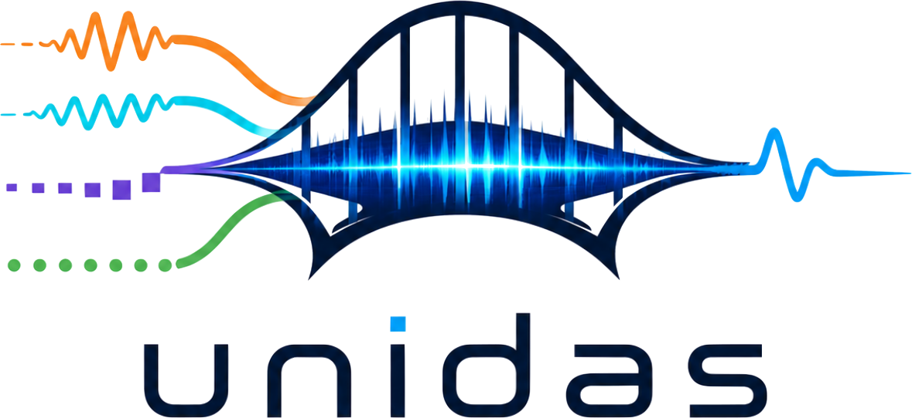{.fragment data-fragment-index="3" fig-align="center" width="94%"}

[github.com/DASDAE/unidas]{.project-url .fragment data-fragment-index="3"}
:::

::::

::: {.notes}
Say the concession first and mean it: five independent designs is how a field
finds out what works. Unidas is the existence proof that the conversion can be
written once instead of five times.
:::

## Gaps: Tensor Acceleration

:::: {.columns}

::: {.column width="52%"}
The shared layer is NumPy. Acceleration is bolted on one project at a time.

- Sixteen reach for PyTorch, eight for Dask, three for CuPy
- None of it is portable — the Array API is the target
:::

::: {.column width="48%"}
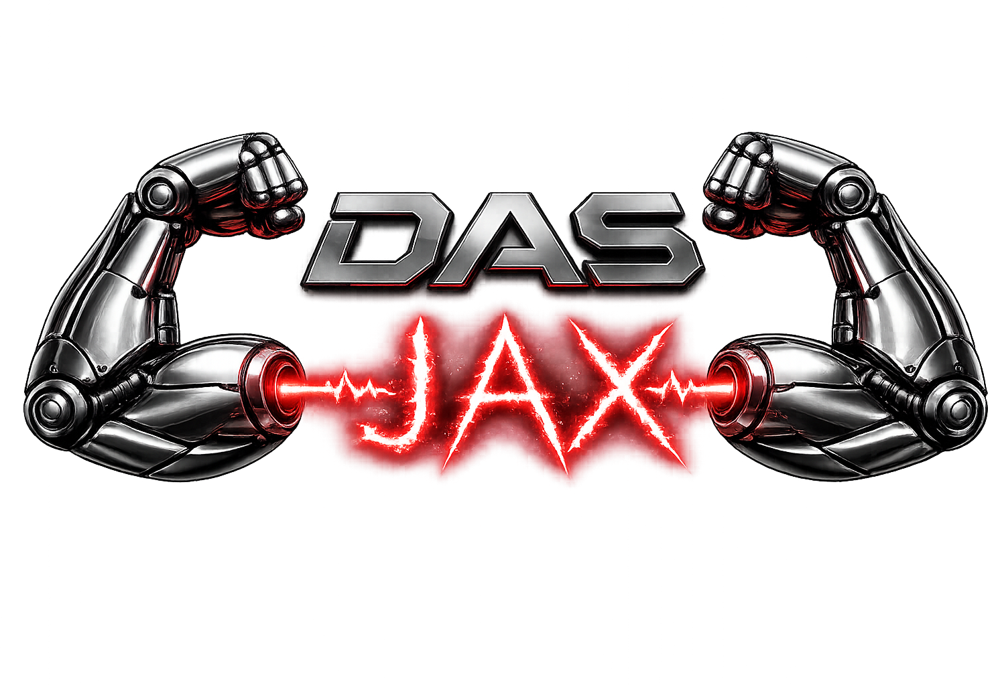{.fragment data-fragment-index="2" fig-align="center" width="88%"}

[github.com/DASDAE/dasjax]{.project-url .fragment data-fragment-index="2"}
:::

::::

::: {.notes}
All 65 Python projects declare NumPy, and none of the five infrastructure
packages depends on an accelerator library beyond Numba and Dask. Plenty of
individual projects reach for PyTorch or CuPy -- the PyTorch bar is on the
dependency slide -- but each does it its own way, so nothing moves between them.
:::

## Gaps: Metadata Management

:::: {.columns}

::: {.column width="46%"}
Every project invents its own station, channel and geometry fields.

- Seismology solved this once, with an inventory
- Fiber needs the same thing, not a sixth dialect
:::

::: {.column width="54%"}
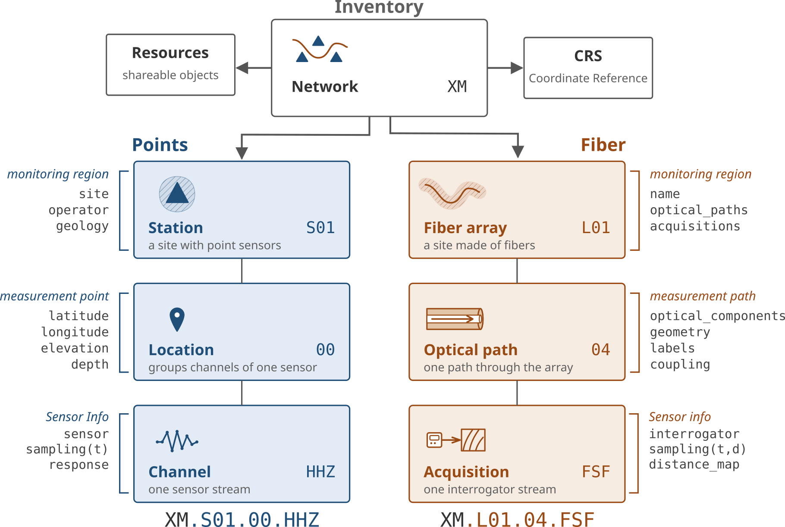{.fragment fig-align="center" width="98%"}
:::

::::

::: {.notes}
One integrated, reusable inventory. The right-hand sketch is what that could
look like: the point-sensor hierarchy on the left, the fiber one beside it.
:::

## Gaps: Large-Scale Tiling and Visualization

:::: {.columns}

::: {.column width="52%"}
Seven viewers in the census. Nothing in it depends on any of them.

- Multi-resolution, streaming, annotation — each solved separately
- The one gap where more tools has not meant more capability
:::

::: {.column width="48%"}
::: {.content-visible when-format="revealjs"}
[?]{.question-mark}
:::

::: {.content-visible when-format="beamer"}
```{=latex}
\vfill\begin{center}{\fontsize{100}{120}\selectfont\color{inerisblue}?}\end{center}\vfill
```
:::
:::

::::

::: {.notes}
Not for want of effort: MultiResViewer, FiLark, DAS_NIDF, DASexplorer, Xpick,
DASSourceLocator and DerZug are all in the census, and several are named on the
network slide. Not one of them is a dependency of anything else. The question
mark is which the field converges on, not whether anyone is trying.
:::

## Gaps: Agent Support

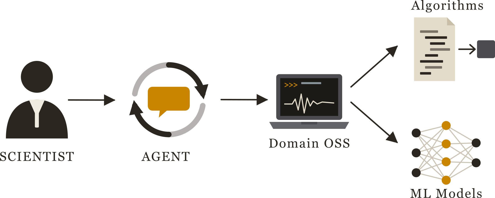{fig-align="center" width=70%}

- Readable interfaces, stable contracts, honest errors

::: {.notes}
The Tools we write now are the tools agents will use. This slide is about the
code that already exists: make it legible and predictable and an agent can
drive it. Nothing here is agent-ready yet.
:::

## Gaps: Agent Support

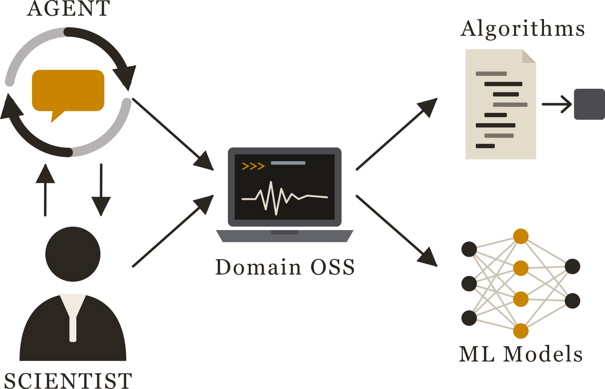{fig-align="center" width=64%}

- The scientist stays in the loop, and so does the agent

::: {.notes}
The second point, and a different one: not the agent standing between the
scientist and the software, but both of them reaching it. That is the shape
worth designing for.
:::

## Conclusions

:::{.increment}
- A young field: most projects began after 2020: many more appear each year
- Python and GitHub dominate
- Most build on NumPy, not on each other (5 infrastructure tools)
- Gaps and Opportunities: 
  - Interoperability, Tensor Processing, Visualization, Agentic Support 
- Interoperate rather than re-implement
:::


::: {.notes}
Close on the call to action: publish it, declare your dependencies, and reuse a
data model rather than inventing a sixth.
:::

## Thank you

::: {.nonincremental}
derrick.chambers@ineris.fr · github.com/d-chambers

**github.com/d-chambers/oss_das_software_survey**
:::

::: {.notes}
Check your own project's record and send a correction.
:::

# Backup {visibility="uncounted"}

## Which projects each number counts {visibility="uncounted"}

| | Where it appears | What it counts |
|---|---|---|
|  | Funnel | Everything the search found |
|  | Totals, engineering | In scope: DAS-native, not excluded |
|  | Dependency bars | Ships any `.py` or `.ipynb` |
|  | Network, two ecosystems | Ships a dependency manifest |
|  | Language chart | Python is the *primary* language |
|  | — | Both of the two above |
|  | Engineering | Has a root packaging file |
|  | Engineering | Actually published to PyPI |
|  | Two ecosystems, seismology side | Same manifest gate, scraped corpus |

::: {.notes}
The flip-to slide when someone subtracts two numbers. In one line:
 counts *has Python*,
 counts *declares dependencies*,
 counts *is mostly
Python*.

The dependency figure is not gated on manifests on purpose. For the ten Python
projects that ship none, an import is the only evidence there is, and dropping
them would bias the answer toward the projects tidy enough to package. The
ecosystem graph has to be gated, because the seismology corpus beside it was
scraped and its imports were never read -- same instrument on both sides or the
comparison means nothing.
:::

## Call to action {visibility="uncounted"}

-  of  are installable — on PyPI, conda or Julia
-  are set up as a package, so most of the work is already done
- Declare your dependencies; reuse a data model rather than inventing a sixth

::: {.notes}
Held back for questions. The gap between "set up as a package" and "published"
is the cheapest thing in this talk to fix.
:::
