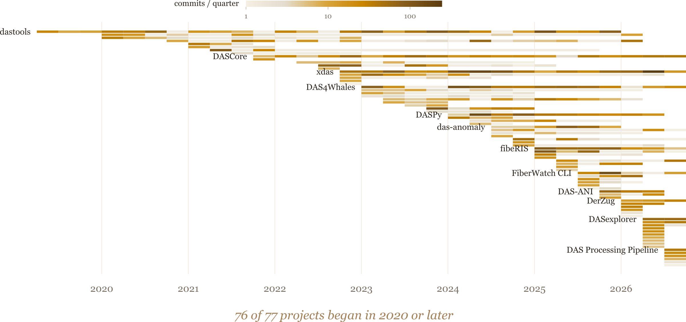
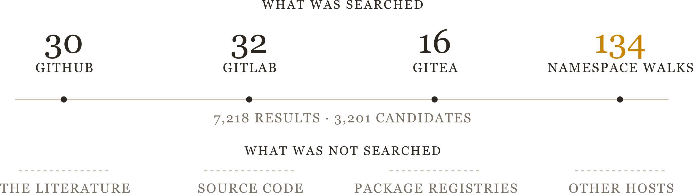
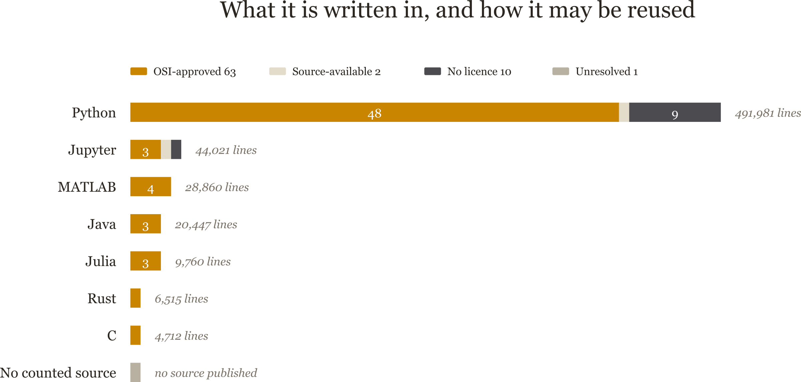

## Why tools?

::: {.nonincremental}
{height=68%}
:::

::: {.notes}
A field is named for its material. Stone, bronze, iron. Ours is named for the
fibre, but what we actually work in is software, and nobody has surveyed it.
:::

## What is out there?

{height=78%}

::: {.notes}
 candidates from forge search, registries and
the literature. Every one leaves by exactly one route. What survives is
 DAS projects, plus 
seismology tools that also support DAS and 
projects for temperature or strain.
:::

## The ecosystem in five numbers

{width=98%}

::: {.notes}
 projects,
 contributors,
 commits,
 lines,
 citations.

Say the caveat on citations out loud: they cover only
 of the
 projects, so it is a floor. Lines of
code is the softest number here — a handful of repositories carry vendored
content — so lead with projects and commits if challenged.
:::

## A field younger than its instruments

{height=76%}

::: {.notes}
One bar per project, ordered by first commit. 76 of the
 began in 2020 or later; only dastools
predates it. The hardware is
decades old; essentially all of the software is five years old or less. That is
the single fact that explains everything that follows.
:::

## Can it be depended on?

{height=76%}

::: {.notes}
Four questions a stranger asks before depending on your code. Most answer the
licence one. Two-thirds carry a packaging manifest --
 of
 -- but only
 ever published one. That is the mechanical
reason for the next slide.
:::

## We build on NumPy, not on each other

{height=76%}

::: {.notes}
This is the finding.  of
 projects depend on nothing in this
census and nothing depends on them. DASCore with
 dependents, five others with two or three
each, and everything else standing alone. The figure shows 21 that depend on
another and 10 that are depended on -- five projects are in both columns, so
those do not add up to the 26 connected.

If asked why DASCore reads 13 here and 8 on the next slide: this graph counts
declared manifests and imports; the comparison counts manifests only, because
that is the only evidence available for seismology repositories read over an
API rather than cloned.
:::

## Half as connected as seismology

{width=98%}

::: {.notes}
Same measurement, both fields, manifests only so the two are comparable.
Seismology has ObsPy, depended on by
 of its
 projects. The denominator narrows from
 to
 on our side because only those carry a
packaging manifest, which is the only bar both fields can be measured on. We have no
equivalent. Say "roughly half as connected", not the precise percentages — the
DAS set is hand-curated and the seismology set is scraped, so the comparison is
directional.
:::

## Five tools, five different jobs

### I maintain DASCore. {.alert}

- **DASCore** — general data handling and package foundations
- **xdas** — very large or live continuous acquisitions, and foundations at scale
- **DASPy** — broad seismological analysis in scripts and notebooks
- **DAS4Whales** — marine bioacoustics, end to end
- **Lightguide** — Pyrocko modelling and the published AFK filter

::: {.notes}
There is no universal winner, because these occupy different layers. Disclose
here, out loud, that I maintain DASCore — and say which criterion I weighted
and where I would choose differently: if larger-than-memory or real-time
processing is central rather than incidental, start with xdas.
:::

## "Large data" means five different things

- **DASCore** — indexes, selects and chunks across files; each patch eager
- **xdas** — virtual arrays, stateful chunk-continuous pipelines, streaming
- **DASPy** — continuous-file processing that carries filter state across boundaries
- **DAS4Whales** — targeted Dask and xarray helpers over NumPy workflows
- **Lightguide** — Rust-accelerated AFK denoising

::: {.notes}
Each of these is a reasonable answer to a different question. None of the labels
guarantees a given workflow is faster — benchmark the actual operation chain.
:::

## The choice you cannot reverse

- The **data model** leaks into your public API
- Immutable patches, virtual arrays, mutable 2-D sections, bare NumPy
- Conversion exists — but is not lossless
- Licences differ more than the features do

::: {.notes}
Unidas adapts four of the containers, and DASPy converts among several. But an
xarray round trip densifies xdas's compact coordinates, and MiniSEED cannot
carry every DAS field. Licences: LGPL, GPL, MIT, and one CC BY-NC-SA — the last
needs a conversation before you depend on it downstream.
:::

## Where the gaps are

- GPU and array-API processing beyond NumPy
- Metadata: one reusable, integrated inventory
- Visualisation at acquisition scale
- Agent-readable interfaces

::: {.notes}
These are the four places where nothing in the census is a complete answer yet.
:::

## What agent-ready software looks like

::: {.nonincremental}
{height=68%}
:::

## Conclusions

- 76 of  projects began in 2020 or later
- Most projects build on nothing
- Five tools cover five different jobs
- Interoperate rather than re-implement

::: {.notes}
Close on the call to action: publish it, declare your dependencies, and reuse a
data model rather than inventing a sixth.
:::

## Thank you

::: {.nonincremental}
derrick.chambers@ineris.fr · github.com/d-chambers

github.com/d-chambers/oss_das_software_survey
:::

# Appendix

## How the search was run

{width=98%}

::: {.notes}
The honest limitations slide. Four discovery routes were not taken, and most
rejections came from one deterministic rule.
:::

## Languages and licences

{height=76%}

## What the work went into

{width=98%}

## What it is all built on

{width=98%}
