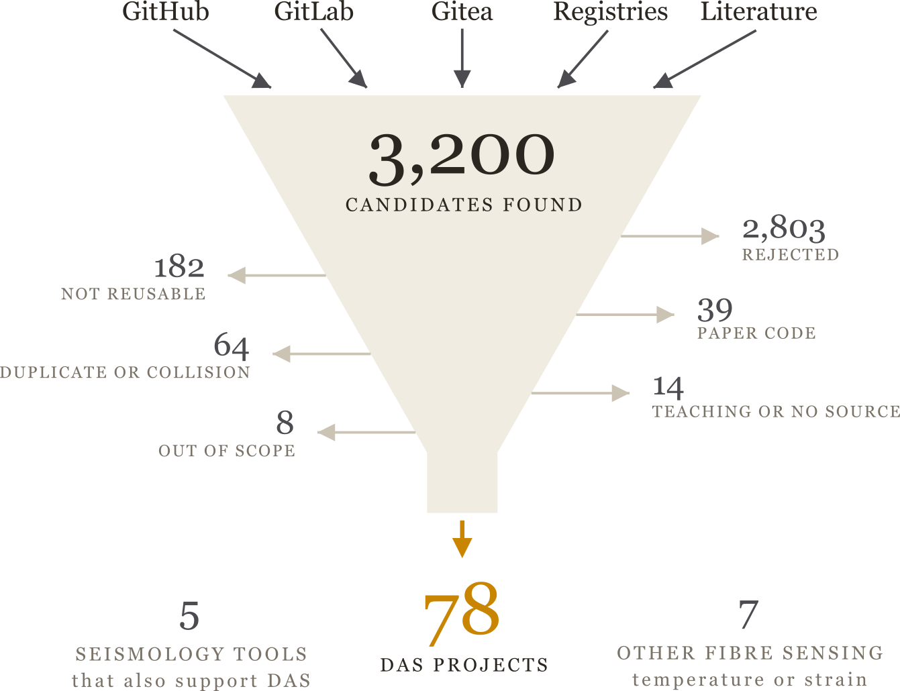
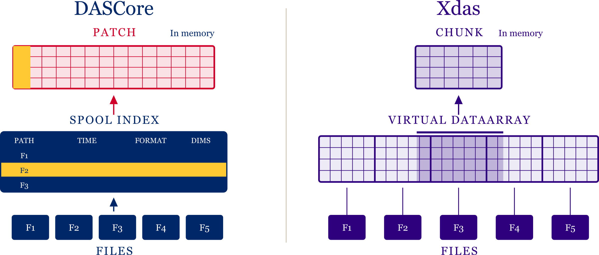
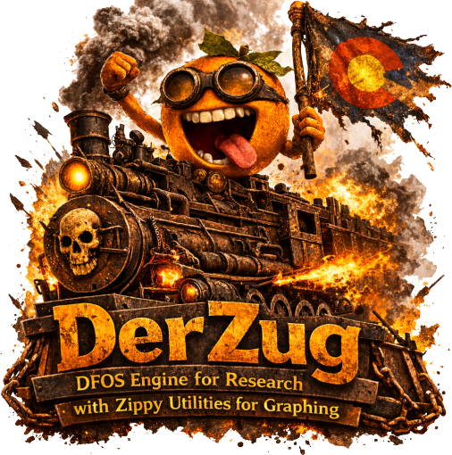

# Why give a talk about tools?

## Motivation

{fig-align="center" width=88%}

::: {.notes}
We name an age for the material its tools were made from. Stone, bronze, iron.
The instrument is what the era is remembered by.
:::

## Motivation

{fig-align="center" width=96%}

::: {.notes}
Seismology runs on two tracks. The instruments are the top row, and they are
what we name our eras after — we are in the distributed age now.

But every instrument was only ever as good as what we could do with what it
recorded. The bottom row is the one that actually moved: felt reports, rulers
and tables, compiled code, dynamic languages, models. Our era's bottom row is
software, and nobody had surveyed it.
:::

## Motivation

{fig-align="center" width=94%}

## Motivation

{fig-align="center" height=64%}

::: {.notes}
Every one of us writes the same readers, the same filters, the same plots.
:::

# What open DAS tools exist?

## The tools

{fig-align="center" height=70%}

::: {.notes}
Start from everything, not from what I already knew about.
:::

## The tools

{fig-align="center" height=76%}

::: {.notes}
 candidates from forge search, registries and the
literature. Every one leaves by exactly one route. What survives is
 DAS projects, plus
 seismology tools that also support DAS and
 for temperature or strain.
:::

## The tools

{fig-align="center" width=98%}

::: {.notes}
 projects,
 contributors,
 commits,
 lines,
 citations.

Citations cover only  of the
projects, so that one is a floor. Lines of code is the softest number — a few
repositories carry vendored content — so lead with projects and commits if
pushed.
:::

## The tools

{fig-align="center" width=98%}

::: {.notes}
Each year's growth comes mostly from projects that did not exist the year
before. This is a field still arriving, not one consolidating.
:::

## The tools

{fig-align="center" width=98%}

::: {.notes}
Python and GitHub, overwhelmingly. That is a strength — one ecosystem to
interoperate within.
:::

## The tools

{fig-align="center" height=74%}

::: {.notes}
Four questions a stranger asks before depending on your code. Most answer the
licence one. Two-thirds carry a packaging manifest —
 of
 — but only
 ever published one. That is the mechanical
reason for the next slide.
:::

## The tools

{fig-align="center" height=74%}

::: {.notes}
This is the finding.  of
 projects depend on nothing in this
census and nothing depends on them. DASCore with
 dependents, five others with two or three
each, everything else standing alone.

The figure shows 21 depending on another and 10 depended on; five projects are
in both columns, so those do not sum to the 26 connected.
:::

## The tools

{fig-align="center" width=98%}

::: {.notes}
Same measurement, both fields, manifests only so the two are comparable.
Seismology has ObsPy, depended on by
 of its
 projects. We have no equivalent.

Say "roughly half as connected", not the precise percentages — our set is
hand-curated and theirs is scraped.
:::

## The tools

{fig-align="center" width=98%}

::: {.notes}
And here is what we do build on. NumPy in 98 per cent, then Matplotlib, SciPy,
h5py. ObsPy at 36 per cent — from a different field. We share a foundation, it
just is not ours.
:::

# Which projects to build on?

## I maintain DASCore

::: {.nonincremental}
Take everything that follows with that in mind.
:::

::: {.notes}
Say it plainly, early, and once.
:::

## The five

:::: {.content-visible when-format="revealjs"}
{.absolute .fragment top="23.7%" left="2.2%" width="26.1%"}
{.absolute .fragment top="23.7%" left="32.9%" width="34.3%"}
{.absolute .fragment top="21.4%" left="67.7%" width="32.3%"}
{.absolute .fragment top="58.2%" left="29.7%" width="40.6%"}
{.absolute .fragment top="74.6%" left="5.6%" width="14.8%"}
::::

:::: {.content-visible when-format="beamer"}
DASCore · DASPy · DAS4Whales · xdas · Lightguide
::::

::: {.notes}
Five packages do the infrastructure work. Bring them up one at a time.
:::

## Licence permissivity

:::: {.content-visible when-format="revealjs"}
{.absolute .fragment top="32.4%" left="6.4%" width="22.7%"}
{.absolute .fragment top="46.6%" left="30.7%" width="22.8%"}
{.absolute .fragment top="12.3%" left="35.8%" width="12.7%"}
{.absolute .fragment top="44.3%" left="55.0%" width="19.1%"}
{.absolute .fragment top="26.6%" left="71.5%" width="27.0%"}
[Non-Commercial]{.axis-label .absolute top="79.0%" left="1.0%" width="20%"}
[GPL]{.axis-label .absolute top="79.0%" left="27.4%" width="20%"}
[LGPL]{.axis-label .absolute top="79.0%" left="50.7%" width="20%"}
[MIT]{.axis-label .absolute top="79.0%" left="74.0%" width="20%"}
[Licence permissivity &rarr;]{.axis-caption .absolute top="89.0%" left="20.8%" width="20%"}
::::

:::: {.content-visible when-format="beamer"}
- **DAS4Whales** — CC BY-NC-SA, non-commercial
- **xdas**, **Lightguide** — GPL-3.0
- **DASCore** — LGPL-3.0
- **DASPy** — MIT
::::

::: {.notes}
Left to right, least permissive to most. DAS4Whales carries a content licence
rather than a software one — worth a conversation before depending on it.
:::

## Data model

:::: {.content-visible when-format="revealjs"}
{.absolute .fragment top="41.0%" left="0.5%" width="22.8%"}
{.absolute .fragment top="36.2%" left="15.1%" width="19.1%"}
{.absolute .fragment top="40.1%" left="39.3%" width="12.7%"}
{.absolute .fragment top="27.3%" left="43.9%" width="34.3%"}
{.absolute .fragment top="25.1%" left="76.6%" width="22.7%"}
[Xarray-inspired, labelled multidimensional]{.axis-label .absolute top="73.7%" left="2.1%" width="20%"}
[Unified object, fixed dimensions]{.axis-label .absolute top="73.7%" left="37.1%" width="20%"}
[Arrays and dicts of metadata]{.axis-label .absolute top="73.7%" left="73.3%" width="20%"}
[&larr; More general, more complex]{.axis-caption .absolute top="95.0%" left="1.5%" width="20%"}
[Simpler, less flexible &rarr;]{.axis-caption .absolute top="95.0%" left="62.2%" width="20%"}
::::

:::: {.content-visible when-format="beamer"}
- **xdas**, **DASCore** — labelled, multidimensional, Xarray-inspired
- **Lightguide**, **DASPy** — one unified object, fixed dimensions
- **DAS4Whales** — arrays and dictionaries of metadata
::::

::: {.notes}
The choice you cannot reverse: the data model leaks into your public API.
General costs complexity; simple costs flexibility.
:::

## Five tools, five different jobs

- **DASCore** — general data handling and package foundations
- **xdas** — very large or live acquisitions, and foundations at scale
- **DASPy** — broad seismological analysis in scripts and notebooks
- **DAS4Whales** — marine bioacoustics, end to end
- **Lightguide** — Pyrocko modelling and Rust-accelerated AFK denoising

::: {.notes}
No universal winner: these occupy different layers. If larger-than-memory or
real-time processing is central rather than incidental, start with xdas.
:::

## "Large data" means five different things

- **DASCore** — indexes, selects and chunks across files; each patch eager
- **xdas** — virtual arrays, chunk-continuous pipelines, streaming
- **DASPy** — continuous-file processing carrying filter state across boundaries
- **DAS4Whales** — targeted Dask and xarray helpers over NumPy workflows
- **Lightguide** — Rust-accelerated AFK denoising

::: {.notes}
Each is a reasonable answer to a different question. None of these labels
guarantees a given workflow is faster — benchmark the actual chain.
:::

## The choice you cannot reverse

{fig-align="center" width=90%}

::: {.notes}
The data model leaks into your public API. Conversion exists — Unidas adapts
four containers — but an xarray round trip densifies xdas's compact
coordinates, and MiniSEED cannot carry every DAS field.
:::

# What are the gaps and opportunities?

## Interoperability

{fig-align="center" height=58%}

- Overlap drives innovation — fragmentation costs users

::: {.notes}
Say the concession first and mean it: five independent designs is how a field
finds out what works. The cost is only paid when they cannot talk.
:::

## GPU and beyond NumPy

{fig-align="center" height=58%}

- Array API, not one array library
- Watch: Coordax, xarray_jax, wax-ml, einx

## Metadata

{fig-align="center" height=62%}

- One integrated, reusable inventory

## Agent–human collaboration

{fig-align="center" height=56%}

- Readable interfaces, stable contracts, honest errors

::: {.notes}
The tools we write now are the tools agents will use. Nothing here is
agent-ready yet.
:::

## Conclusions

- A young field: 76 of  projects began in 2020 or later
- Most build on NumPy, not on each other
- Five tools already cover five different jobs
- Interoperate rather than re-implement

::: {.notes}
Close on the call to action: publish it, declare your dependencies, and reuse a
data model rather than inventing a sixth.
:::

## Thank you

::: {.nonincremental}
derrick.chambers@ineris.fr · github.com/d-chambers

**github.com/d-chambers/oss_das_software_survey**
:::

::: {.notes}
Check your own project's record and send a correction.
:::
